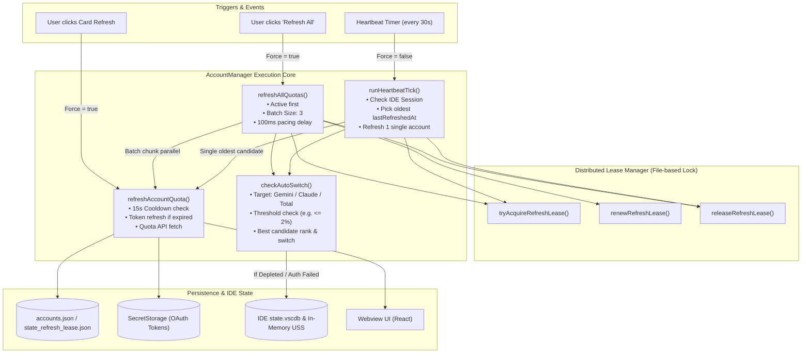
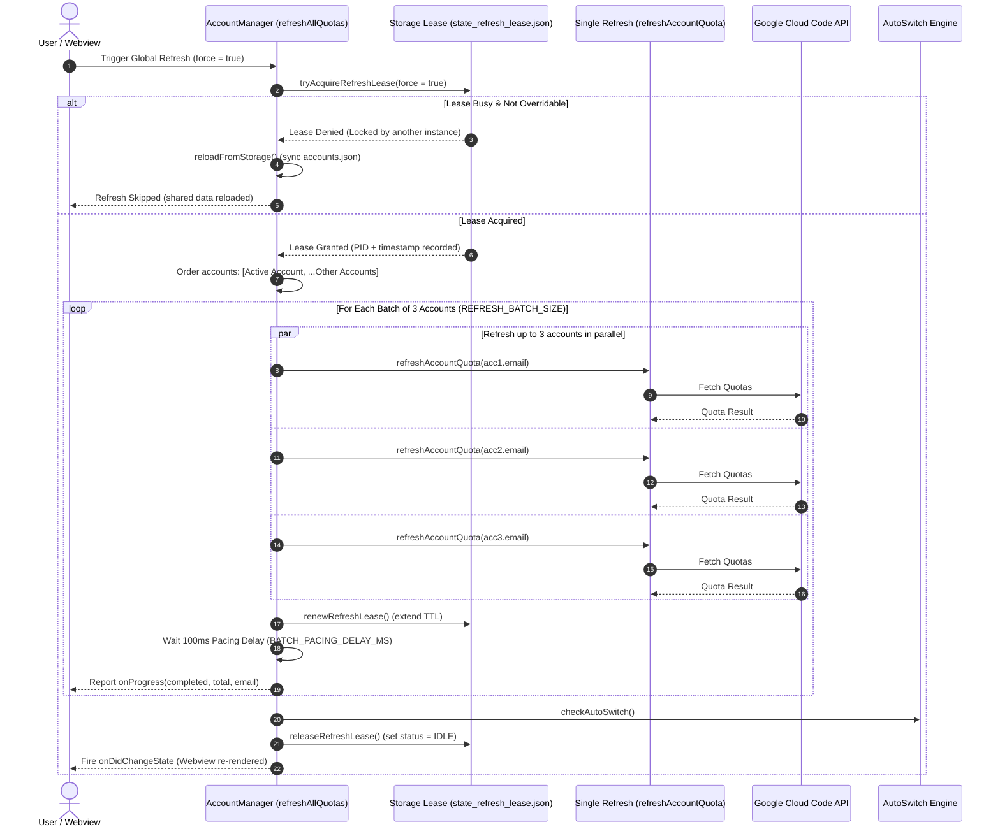
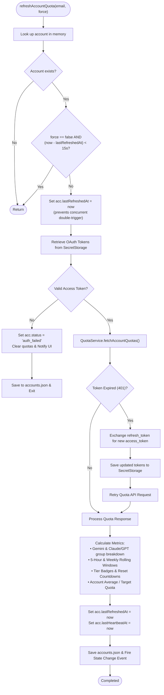
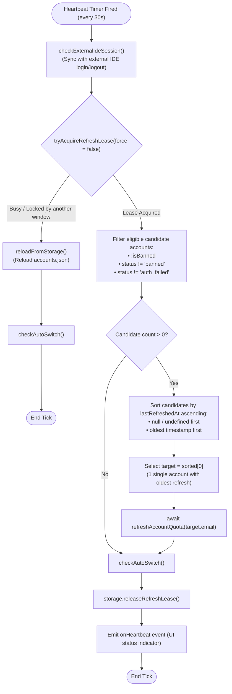
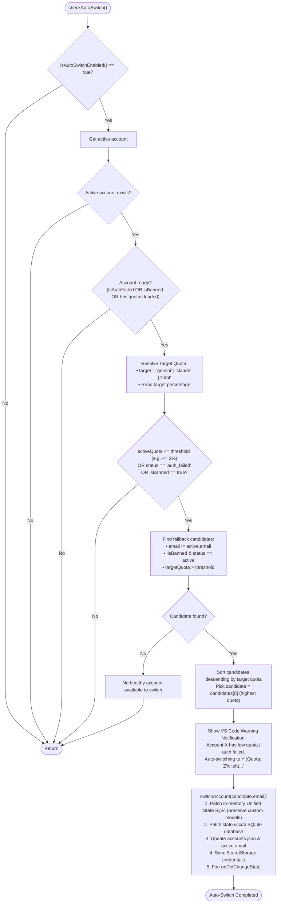

# Antigravity Swap — Refresh & Auto-Switch Architecture & Flow Diagrams

This document details the exact operational flow and distributed architecture of **Antigravity Swap** across four core mechanisms:
1. **Global Refresh** (Batch Chunking & Distributed Pacing)
2. **Single Account Refresh** (Rate Limiting, OAuth Token Refresh & Quota Scraping)
3. **Background Refresh** (Heartbeat Tick & Oldest-Account / LRU Rotation)
4. **Auto-Switch** (Threshold Evaluation, Candidate Ranking & Atomic Switching)

---

## 1. Overview Architecture Diagram

---

## 2. Global Refresh Flow

Triggered when the user clicks **"Refresh All"** in the Controller Bar or runs the VS Code command `antigravity-swap.refreshQuotas`.

---

## 3. Single Account Refresh Flow

Triggered individually per account card, or internally invoked by Global/Background refresh.

---

## 4. Background Refresh Flow (Heartbeat Tick)

Runs periodically via `HeartbeatService` (default: every **30 seconds**). Unlike Global Refresh, it uses an **LRU / Oldest-Unrefreshed Account** selection mechanism to minimize network load and API rate consumption.

---

## 5. Auto-Switch Flow

Triggered immediately after any quota refresh operation or external account sync.

---

## 6. Summary Comparison Table

| Feature | Global Refresh | Single Refresh | Background Refresh (Heartbeat) | Auto-Switch |
| :--- | :--- | :--- | :--- | :--- |
| **Invocation** | User clicks "Refresh All" or Command | User clicks card refresh or API hook | Periodic interval timer (`30s`) | Triggered post-refresh automatically |
| **Lease Lock** | `tryAcquireRefreshLease(true)` | Per-account cooldown (`15s`) | `tryAcquireRefreshLease(false)` | In-memory evaluation |
| **Target Scope** | **All** registered accounts | **1 specific** targeted account | **1 single oldest** unrefreshed account (LRU) | Switches active session to highest-quota account |
| **Concurrency** | Parallel batches of **3 accounts** (`REFRESH_BATCH_SIZE`) | Single execution | Single execution | Single atomic switch |
| **Pacing / Rate Limit** | `100ms` delay between batch chunks | `15s` silent skip cooldown | Spaced out by heartbeat interval (`30s`) | N/A |
| **Impact on IDE** | Quota gauges updated | Quota card updated | Seamless continuous quota rotation | In-memory USS + SQLite `state.vscdb` patched live |
