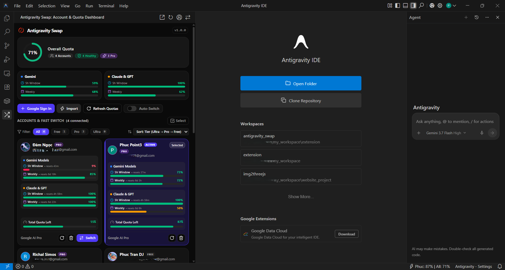
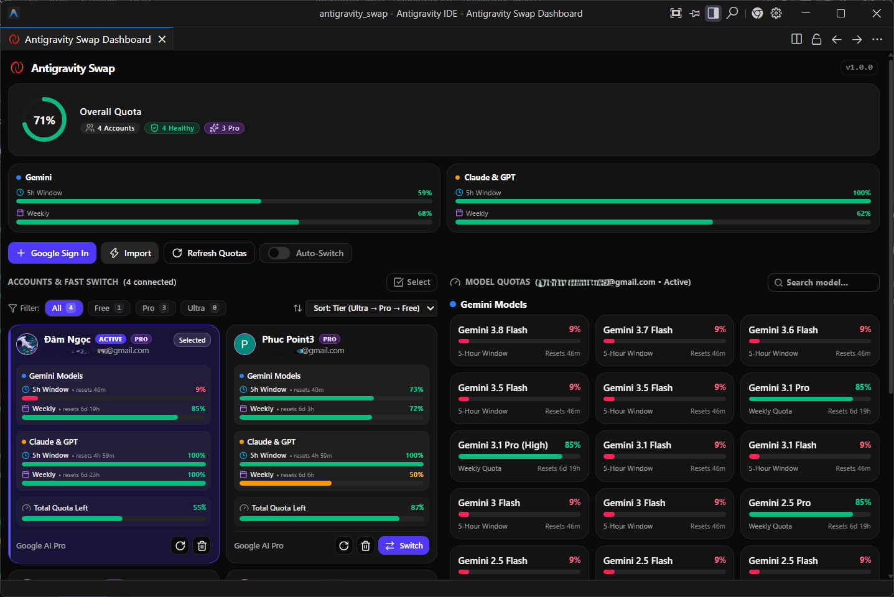

# Antigravity Swap ⚡

**Antigravity Swap** is a high-performance extension for **Antigravity IDE** that enables **seamless multi-account switching without reloading the IDE window**, provides **real-time per-model quota tracking**, and displays **overall combined capacity across all accounts**.

---

## 📸 Preview

### Sidebar Integration & Fast Switch
Integrated directly into the Antigravity IDE sidebar with account overview and instant switching:

### Wide Quota Dashboard & Per-Model Breakdown
Full dashboard view with responsive side-by-side account management and real-time per-model quota monitors:

---

## ✨ Key Features

- 🔄 **Zero-Reload Account Switching**: Switch between multiple Google / Antigravity accounts instantly without reloading windows or restarting your IDE.
- 🪟 **Real-Time Multi-Instance Sync**: Seamlessly synchronizes accounts, active status, and preferences across all your open IDE windows in real-time.
- 🤖 **Smart Auto-Switch on Low Quota**: Automatically switches to the healthiest account with the highest remaining balance when your active quota runs low.
- 🪟 **Detachable Floating Dashboard**: Pop out the dashboard into an independent native floating window to monitor quotas alongside your workspace.

> [!TIP]
> **Recommended Account Capacity**: To ensure optimal synchronization performance and avoid automated spam or rate-limiting flags from upstream services, we recommend adding a maximum of **70 accounts**.

---

## 🛠 Available Commands

| Command | Title | Description |
| :--- | :--- | :--- |
| `antigravitySwap.openDashboard` | **Open Quota Dashboard** | Open the rich dashboard in the sidebar |
| `antigravitySwap.popOutDashboard` | **Pop Out Dashboard** | Detach the dashboard into a native floating window |
| `antigravitySwap.switchAccount` | **Switch Active Account** | Switch between accounts instantly without reloading |
| `antigravitySwap.importCurrentAntigravity` | **Import Active Antigravity Account** | 1-click import of the active session from Antigravity IDE |
| `antigravitySwap.reloginAccount` | **Re-login / Reconnect Account** | Re-authenticate or reconnect an expired account |
| `antigravitySwap.addAccount` | **Add Account (Google OAuth)** | Connect a new account via Google OAuth web flow |
| `antigravitySwap.refreshQuotas` | **Refresh All Account Quotas** | Fetch fresh quota balances from cloud server |
| `antigravitySwap.importExistingAccounts` | **Import Detected Accounts** | Auto-detect accounts from local IDE database |
| `antigravitySwap.restoreOriginalIdeExtension` | **Restore Original IDE Extension** | Revert IDE session bridge back to original pristine backup |
| `antigravitySwap.enableIdeExtensionPatch` | **Enable IDE Extension Optimization** | Re-enable zero-reload session synchronization |

---
## ⚙️ Configuration Settings

- `antigravitySwap.enableIdePatch`: (Default: `true`) Enables automated session synchronization for seamless zero-reload switching.
- `antigravitySwap.heartbeatIntervalSeconds`: (Default: `30`) Heartbeat interval in seconds to poll quota health and detect expired/banned accounts.
- `antigravitySwap.autoSwitchWhenQuotaLow`: (Default: `false`) Automatically switch to another account when current active quota is exhausted.
- `antigravitySwap.lowQuotaThresholdPercent`: (Default: `2`) Percentage threshold below which the active account triggers auto-switching to another healthy account.
- `antigravitySwap.autoSwitchTarget`: (Default: `"gemini"`) Quota target to monitor for auto-switch (`"gemini"`, `"claude"`, or `"total"`). When a model family is selected, it monitors the 5-Hour window for Pro/Ultra accounts or Weekly balance for Free accounts.

---

## 🔄 IDE Session Integration & Manual Restoration

### ❓ Why is IDE Session Optimization Needed?
By default, **Antigravity IDE** is designed around a single static account login. When switching accounts dynamically, the default session listener in the IDE would normally require a full window reload, or cause multiple inactive sessions to accumulate and conflict in the IDE's account menu.

The built-in session bridge seamlessly handles session transitions:
- **Instant Live Switching**: Updates authentication state in real time so the Language Server and AI Agent immediately accept the new account with **zero window reload**.
- **Clean Session Management**: Evicts previous inactive sessions to prevent account stacking and ensure only your currently active account is bound to IDE services.

> [!NOTE]
> **Top-Right Avatar & Display Name Behavior upon Switching**
> When switching accounts without reloading the window, the active account's **display name, email, credentials, and model quotas switch immediately**.
> The avatar icon in the top-right corner of the IDE header may retain the cached profile image of the previous session until the IDE is completely restarted / re-launched — this is purely cosmetic. As long as the account display name and email reflect the switched account, your AI prompts, quota tracking, and Language Server services are 100% operating under the new account.

> [!IMPORTANT]
> **Pristine Backup Location & Manual Restoration Guide**
> 
> Before applying session optimization, an untouched pristine backup (`extension.js.bak`) is **always created automatically**.
> 
> - **Original Backup File Location**:
>   - **Windows**: `%LOCALAPPDATA%\Programs\Antigravity IDE\resources\app\extensions\antigravity\dist\extension.js.bak`
>   - **macOS / Linux**: `~/.local/share/antigravity/resources/app/extensions/antigravity/dist/extension.js.bak` (or `/usr/share/antigravity/resources/app/extensions/antigravity/dist/extension.js.bak`)
> 
> **How to restore original files**:
> 1. **1-Click (Recommended)**: Open Command Palette (`Ctrl+Shift+P` / `Cmd+Shift+P`), run **`Antigravity Swap: Restore Original IDE Extension`**, then reload window.
> 2. **Manual Restoration**: Navigate to the directory path above, delete `extension.js`, and rename `extension.js.bak` back to `extension.js`.
> 
> *Note: The session bridge is completely self-contained and safe for normal IDE usage even if Antigravity Swap is uninstalled. Official Antigravity IDE software updates will also automatically refresh all files.*

---

## 🔒 Security & Privacy

All OAuth tokens and credentials are encrypted and stored inside VS Code's native secure storage (`SecretStorage`), which uses OS-level DPAPI / Keytar encryption. No sensitive tokens are exposed or written to disk in plain text.

---

## ⚠️ Disclaimer & Limitation of Liability

> [!CAUTION]
> **Use at Your Own Discretion**
> 
> - **Antigravity Swap** is an independent, community-developed third-party extension and is **not affiliated with, endorsed by, sponsored by, or officially supported by Google, DeepMind, or Codeium**.
> - This software is provided **"as is"**, without warranty of any kind, express or implied, including but not limited to the warranties of merchantability, fitness for a particular purpose, or non-infringement.
> - The developers and contributors of this extension **assume NO responsibility or liability** for:
>   1. Any account restrictions, suspensions, rate limits, or bans imposed by service providers.
>   2. Any unintended behavior, data loss, IDE crashes, or system instability resulting from modifying local preferences or multi-account usage.
> - You are solely responsible for complying with the respective Terms of Service, Acceptable Use Policies, and rate limits of Google and Antigravity.
