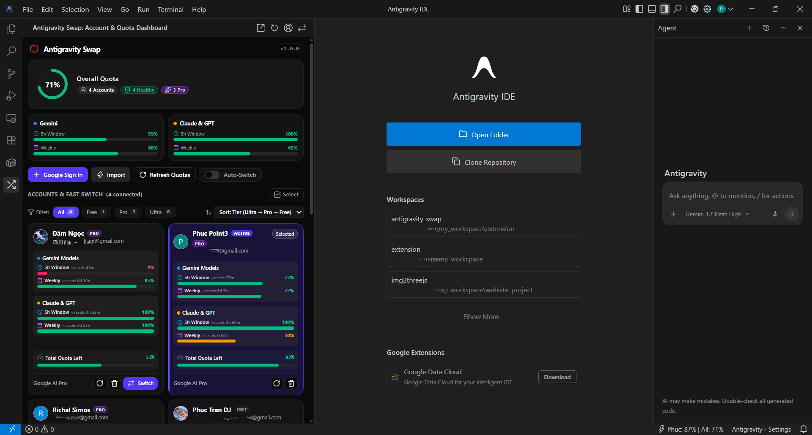
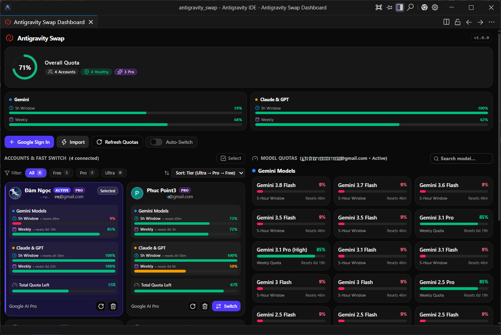

<div align="center">
  
  <h1>Antigravity Swap</h1>
  <p><b>Seamless multi-account hot-switching and real-time per-model quota tracking for Antigravity IDE</b></p>
</div>

---

**Antigravity Swap** is a high-performance extension for **Antigravity IDE** that enables **seamless multi-account switching without reloading the IDE window**, provides **real-time per-model quota tracking**, and features **intelligent auto-switching** to keep you in the flow.

---

## Preview

### Sidebar Integration & Fast Switch
Integrated directly into the Antigravity IDE sidebar with account overview and instant switching:



### Wide Quota Dashboard & Per-Model Breakdown
Full dashboard view with responsive side-by-side account management, Instant quota health gauges, and real-time per-model monitors:



---

## Key Features

- **Zero-Reload Seamless Switching**: Switch between multiple accounts instantly with zero window reload or IDE restart, fully compatible with the latest Antigravity IDE releases.
- **High-Speed Direct Cloud Tracking**: Fast and lightweight quota synchronization directly over secure HTTPS.
- **Decoupled Quota Windows**: Accurately tracks short-term rolling limits and long-term weekly capacity across all supported models.
- **Instant Quota Health**: Intelligently calculates usable capacity to keep your workflow uninterrupted and prevent sudden lockouts.
- **Smart Auto-Switch on Low Quota**: Automatically fails over to the healthiest account with candidate verification and self-healing rollback.
- **Real-Time Multi-Instance Sync**: Synchronizes active credentials, quotas, and state across multiple open IDE windows in real-time.
- **Detachable Floating Dashboard**: Pop out the dashboard into an independent native floating window to monitor quotas alongside your workspace.

---

## Available Commands

| Command | Description |
| :--- | :--- |
| **Open Quota Dashboard**<br>`antigravitySwap.openDashboard` | Open the rich dashboard in the sidebar |
| **Pop Out Dashboard**<br>`antigravitySwap.popOutDashboard` | Detach the dashboard into a native floating window |
| **Switch Active Account**<br>`antigravitySwap.switchAccount` | Switch between accounts instantly without reloading |
| **Import Active Antigravity Account**<br>`antigravitySwap.importCurrentAntigravity` | 1-click import of the active session from Antigravity IDE |
| **Re-login / Reconnect Account**<br>`antigravitySwap.reloginAccount` | Re-authenticate or reconnect an expired account |
| **Add Account (Google OAuth)**<br>`antigravitySwap.addAccount` | Connect a new account via Google OAuth web flow |
| **Refresh All Account Quotas**<br>`antigravitySwap.refreshQuotas` | Fetch fresh quota balances from cloud services |
| **Import Detected Accounts**<br>`antigravitySwap.importExistingAccounts` | Auto-detect accounts from local IDE database |
| **Restore Original IDE Extension**<br>`antigravitySwap.restoreOriginalIdeExtension` | Revert IDE session bridge back to original pristine backup |
| **Enable IDE Extension Optimization**<br>`antigravitySwap.enableIdeExtensionPatch` | Re-enable zero-reload session synchronization |

---

## Configuration Settings

Configure these options in your VS Code / Antigravity IDE `settings.json`:

- `antigravitySwap.enableIdeExtensionPatch`: (Default: `true`) Enables self-healing session synchronization for seamless zero-reload switching.
- `antigravitySwap.autoSwitchWhenQuotaLow`: (Default: `false`) Automatically switch to another healthy account when current active quota is exhausted.
- `antigravitySwap.lowQuotaThresholdPercent`: (Default: `5`) Percentage threshold (0-100%) at or below which auto-switch is triggered.
- `antigravitySwap.autoSwitchTarget`: (Default: `"gemini"`) Quota target to monitor for auto-switching:
  - `"instant"`: Overall account usable burst quota across all models.
  - `"gemini"`: Gemini Instant Quota (5-hour window modulated by weekly capacity).
  - `"claude"`: Claude & GPT Instant Quota (5-hour window modulated by weekly capacity).

---

## IDE Session Integration & Manual Restoration

### How Does Zero-Reload Hot-Switching Work?
Antigravity IDE was originally designed for a single static login session. When dynamically switching accounts, the default session listener would normally require a full window reload.

Antigravity Swap integrates seamlessly with Antigravity IDE:
- **Instant Live Switching**: Automatically synchronizes account credentials and session state in real time so the Language Server and AI Agent immediately accept the new account with **zero window reload**.
- **Fail-Safe Verification & Rollback**: Verifies the active session after switching; automatically restores the previous account if a switch encounters an unexpected issue.
- **Zero Window Reload**: Continue editing code and chatting with the AI agent immediately with no interruption or window reloading.

> [!NOTE]
> **Top-Right Avatar & Profile Display**
> When switching accounts without reloading the window, the active account's **display name, email, credentials, and model quotas switch immediately**.
> The avatar icon in the top-right corner of the IDE header may retain the cached profile image of the previous session until the IDE is completely restarted — this is purely cosmetic. Your AI prompts, quota tracking, and Language Server services are 100% operating under the new account.

### Pristine Backup & Restoration Guide
Before applying session optimization, an untouched pristine backup (`extension.js.bak`) is **always created automatically**.

**Default Backup Paths:**
- **Windows**:
  ```plaintext
  %LOCALAPPDATA%\Programs\Antigravity IDE\resources\app\extensions\antigravity\dist\extension.js.bak
  ```
- **macOS / Linux**:
  ```plaintext
  ~/.local/share/antigravity/resources/app/extensions/antigravity/dist/extension.js.bak
  ```

**How to restore original files:**
1. **1-Click (Recommended)**: Open Command Palette (`Ctrl+Shift+P` / `Cmd+Shift+P`), run **`Antigravity Swap: Restore Original IDE Extension`**, then reload window.
2. **Manual Restoration**: Navigate to the directory above, delete `extension.js`, and rename `extension.js.bak` back to `extension.js`.

---

## Security & Privacy

All OAuth tokens and credentials are encrypted and stored inside native OS secure storage (`SecretStorage` via DPAPI / Keytar). Direct quota requests connect strictly over authenticated HTTPS. No sensitive tokens or private configurations are ever sent to third parties or written unencrypted to disk.

---

## Disclaimer & Limitation of Liability

> [!CAUTION]
> **Use at Your Own Discretion**
> 
> - **Antigravity Swap** is an independent, community-developed third-party extension and is **not affiliated with, endorsed by, sponsored by, or officially supported by Google, DeepMind, or Codeium**.
> - This software is provided **"as is"**, without warranty of any kind, express or implied, including but not limited to the warranties of merchantability, fitness for a particular purpose, or non-infringement.
> - The developers and contributors of this extension **assume NO responsibility or liability** for:
>   1. Any account restrictions, suspensions, rate limits, or bans imposed by service providers.
>   2. Any unintended behavior, data loss, IDE crashes, or system instability resulting from modifying local preferences or multi-account usage.
> - You are solely responsible for complying with the respective Terms of Service, Acceptable Use Policies, and rate limits of Google and Antigravity.
